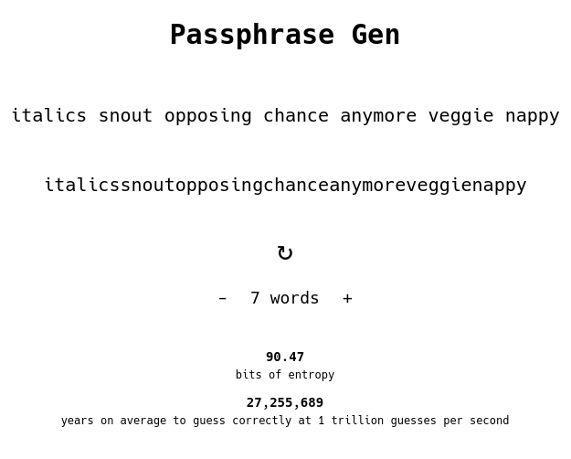

# Passphrase Gen

A passphrase generator of words you can remember. 



### About

Users may opt to use 6 to 10 words to generate a passphrase. The strength of the generated passphrase (measured in bits of entropy) as well as how long on average it would take to guess said passphrase (based on a rough estimate of current computing power), are displayed. This application was inspired by a [xkcd comic](https://xkcd.com/936/) and implemented using the diceware method  (created by Arnold Reinhold). The word list comes from the [EFF's Long Wordlist](https://www.eff.org/dice).  

A mnemonic can be used to more easily remember a phrase (e.g., story/scenario using words in the phrase). The generated passphrases have a range of practical applications like with use in full-disk encryption, encryption keys, password managers, etc. 

### Installation 

Make sure Node.js is installed.
```  
git clone git@github.com:benjaminarnett/passphrase-gen.git
cd passphrase-gen
npm start
```

Go to [localhost:3000](localhost:3000) in a browser to view. Use `npm run build` to create a production build.

### Going Forward

This application was produced using Create React App for the purpose of learning React. Refactoring the existing code base is worth exploring to improve performance and security. Possible improvements include:

- switching from CRA to another technology that's optimized for running single page applications
- adding symbols (optionally) in the generation process
- various language options
- updating the estimate of computing power of attackers based on a reliable standard
